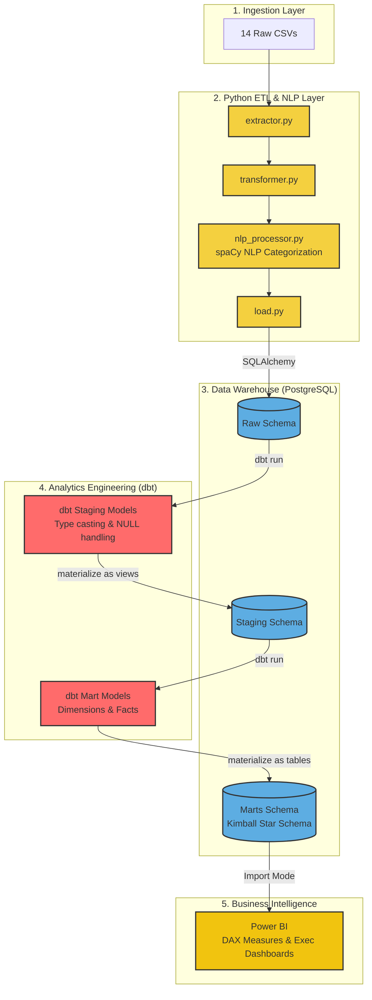

# 🚛 Enterprise Logistics DataOps & Analytics Pipeline

> An end-to-end, production-grade Data Engineering project transforming raw fleet operations data into a fully automated analytics warehouse with executive Power BI reporting.

---

## 📌 At a Glance

| Layer | Technology | Purpose |
|---|---|---|
| Ingestion & NLP | Python, Pandas, spaCy | Parse raw CSVs, fix broken timestamps, categorize free-text logs |
| Warehouse Modeling | dbt (data build tool) | Build a Kimball Star Schema with tested, version-controlled SQL models |
| Storage | PostgreSQL | OLAP-optimized analytical database |
| Business Intelligence | Power BI, DAX | C-Suite Executive Dashboards with Time Intelligence |

---

## 💼 Business Context (For Executives)

Mid-sized freight operations suffer from three silent revenue killers:

1. **Telematics Sensor Drops** — GPS failures corrupt delivery timestamps, making SLA compliance impossible to measure accurately.
2. **Untracked Fuel & Safety Costs** — Fuel card swipes and accident costs are scattered across disconnected spreadsheets, making true trip profitability invisible.
3. **Unstructured Maintenance Logs** — Mechanics write free-text notes like *"fixed the axle issue from last week"* — making fleet cost attribution impossible without NLP.

**This pipeline solves all three** — producing a single, reliable data warehouse that answers:

- *"What is our true cost-per-mile after fuel and incidents?"*
- *"Which routes, drivers, and assets are destroying our SLA compliance?"*
- *"Is our operational performance improving year-over-year?"*

---

## 🏗️ Architecture Overview (For CTOs & Technical Engineers)



---

## 📐 Kimball Star Schema Design

The warehouse implements a strict **Kimball Star Schema** optimized for Power BI's VertiPaq engine:

**Dimension Tables** (The "Who / What / Where"):
- `Dim_Driver` — Driver personnel with `driver_safety_risk_index` and `driver_tenure_days`
- `Dim_Truck` — Fleet assets with `truck_age_years` and `is_underutilized_asset`
- `Dim_Customer` — B2B clients with `concentration_risk_tier`
- `Dim_Route` — Freight lanes with pre-concatenated `route_name`
- `Dim_Facility` — Terminals and warehouses (geospatial coordinates)
- `Dim_Incident_Category` — NLP-powered Safety & SLA delay categorization
- `Dim_Date` — Standard time spine for Time Intelligence DAX

**Fact Tables** (The "How Much / How Many"):
- `Fact_Shipment` — Core grain: 1 row = 1 delivered freight load, with `net_trip_margin`, `is_sla_breached`, and `incident_category_sk`
- `Fact_Fuel_Purchase` — 1 row = 1 fuel swipe event
- `Fact_Maintenance_Event` — 1 row = 1 truck repair, with `cost_per_downtime_hour`
- `Fact_Safety_Incident` — 1 row = 1 accident or DOT citation
- `Fact_Driver_Monthly_Snapshot` — Periodic driver performance snapshot
- `Fact_Truck_Monthly_Snapshot` — Periodic asset utilization snapshot

---

## ⚙️ Technical Highlights (For Data Engineers)

- **Ghost Dimension Pattern:** Upstream identifier loss (`UNKNOWN_TRUCK`, `UNKNOWN_DRIVER`) is resolved to explicit ghost members, ensuring 100% referential integrity without silent NULL joins.
- **Structural Missing Data (MNAR):** `is_telematics_drop` is engineered as a boolean flag where sensor data is absent — no destructive `dropna()` on financial records.
- **NLP Categorization:** spaCy rule-based matching transforms free-text mechanic notes and safety incident descriptions into analytical tags (`Incident_Category`, `Delay_Reason`).
- **SLA Logic:** Delivery is classified as breached when `actual_datetime - scheduled_datetime > 119 minutes`. This feeds `Dim_Incident_Category` via conditional `CASE` logic in `fact_shipment.sql`.
- **dbt Dependency Graph:** dbt automatically resolves build order (e.g., `dim_incident_category` before `fact_shipment`) and provides lineage documentation.
- **Data Quality Tests:** dbt enforces `unique` + `not_null` on all surrogate/natural keys, and `accepted_values` tests on all boolean flags.
- **Automated CI/CD Pipeline:** A GitHub Actions workflow automatically spins up a PostgreSQL container, executes the Python ETL extraction, configures the dbt `profiles.yml`, and runs all dbt models and tests on every push to `main`.


---

## 📊 Power BI DAX Measures

All measures are documented in `powerbi_dax_measures.txt`. Key Time Intelligence measures:

| Measure | DAX Function | Use Case |
|---|---|---|
| `YTD Revenue` | `TOTALYTD` | C-Suite annual budget tracking |
| `Revenue YoY % Change` | `SAMEPERIODLASTYEAR` | Annual growth benchmarking across 3 years |
| `Revenue MoM % Change` | `DATEADD(..., -1, MONTH)` | Operations: early warning on performance drift |
| `Cumulative Revenue` | `FILTER(ALL(Dim_Date))` | 3-year growth trajectory area chart |
| `SLA MoM Variance` | `DATEADD` | Fleet manager: week-to-week SLA health |

---

## 📁 Repository Structure

```
├── .github/workflows/            # CI/CD pipelines (GitHub Actions)
├── src/                          # Python ETL modules
│   ├── extractor.py              # Safe CSV ingestion with error routing
│   ├── transformer.py            # Timestamp, type casting, boolean engineering
│   ├── nlp_processor.py          # spaCy NLP categorization pipeline
│   ├── load.py                   # SQLAlchemy → PostgreSQL loader
│   └── logger.py                 # Centralized pipeline logger
├── dbt_logistics/                # dbt Analytics Engineering project
│   ├── models/staging/           # Raw source-to-typed staging models
│   ├── models/marts/             # Star Schema dimension and fact models
│   └── dbt_project.yml           # dbt project configuration
├── data/                         # Data directory
│   ├── samples/                  # 50-row extracts (Raw vs Processed) for portfolio review
│   └── processed/                # Cleaned CSV outputs from ETL pipeline
├── main.py                       # ETLPipeline orchestrator
├── final_kimball_star_schema.txt # Star Schema design reference
├── powerbi_dax_measures.txt      # All Power BI DAX measures
├── powerbi_deployment_blueprint.md  # Dashboard page design guide
├── calculated_columns_proposal.txt  # Pre-aggregated metric formulas
├── processed_data_dictionary.md  # Column-level data dictionary
└── requirements.txt              # Python dependencies
```

---

## 🚀 How to Run Locally

### 1. Python ETL Pipeline
```bash
# Clone and set up virtual environment
git clone https://github.com/rhassan9/Logistics-DataOps-Pipeline.git
cd Logistics-DataOps-Pipeline
python -m venv venv && source venv/bin/activate

# Install dependencies
pip install -r requirements.txt
python -m spacy download en_core_web_sm

# Configure database credentials
cp .env.example .env  # Fill in your PostgreSQL host, user, password

# Run the full pipeline
python main.py
```

### 2. dbt Data Warehouse Build
```bash
cd dbt_logistics

# Verify database connection
dbt debug

# Build all staging and mart models
dbt run

# Run all data quality tests
dbt test

# Generate and serve documentation
dbt docs generate && dbt docs serve
```

---

## 📈 Key Business Questions This Dashboard Answers

1. **"What is our true net profit per trip, after fuel and incident costs?"** → `net_trip_margin` in `Fact_Shipment`
2. **"Which routes have the worst SLA compliance?"** → `is_sla_breached` joined to `Dim_Route`
3. **"Is our fleet getting safer year-over-year?"** → `SLA YoY Variance` + `Fact_Safety_Incident`
4. **"Which truck assets are underutilized or costing disproportionately in repairs?"** → `is_underutilized_asset` + `cost_per_downtime_hour`
5. **"Which customer accounts represent dangerous revenue concentration risk?"** → `concentration_risk_tier` in `Dim_Customer`